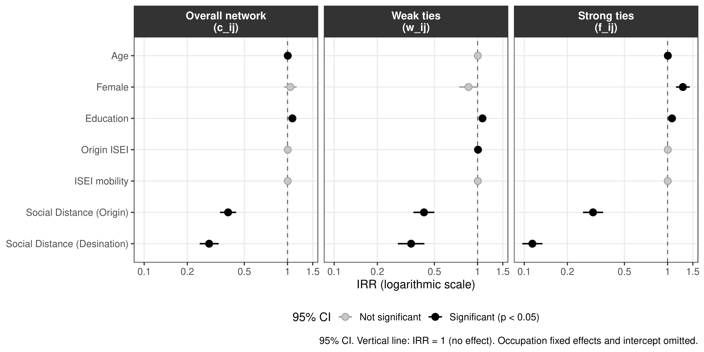
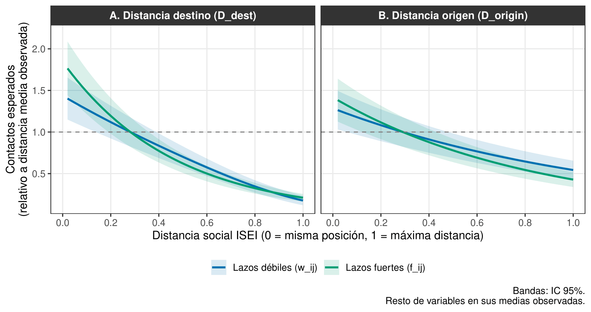
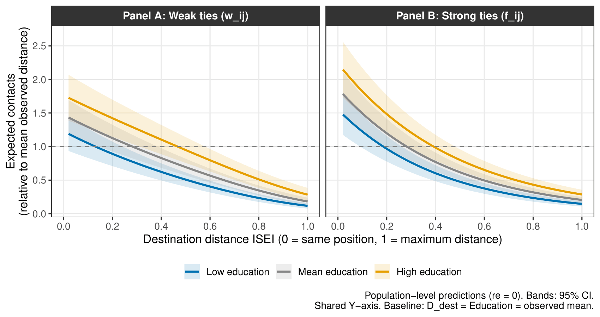
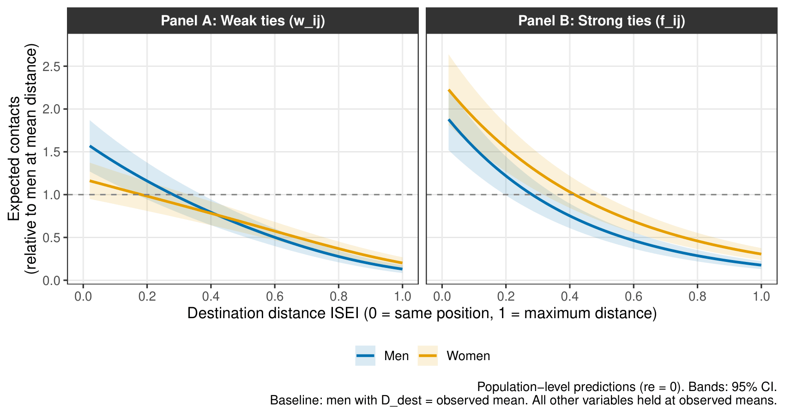

```{=html}
<style>
.reveal .slides {
  font-size: 1.0em;
}
.reveal pre {
  font-size: 0.6em !important;
}
.reveal .slides section.smaller pre {
  font-size: 0.75em !important;
}
</style>
```

```{r}
#| label: setup-fuentes
#| include: false

library(systemfonts)
library(sysfonts)

sysfonts::font_add(
  family  = "Gill Sans MT",
  regular = "GIL_____.TTF",
  bold    = "GILB____.TTF",
  italic  = "GILI____.TTF"
)
showtext::showtext_auto()
```

------------------------------------------------------------------------

## De dónde vengo: el proyecto original {.smaller}

::: fragment
El proyecto sobre atribuciones causales de la riqueza y composición de redes (estatus y diversidad, vía PCA) tuvo un problema de fondo antes que de resultado: la variable dependiente concentraba cerca de dos tercios de sus casos en una sola categoría (atribuciones estructurales), lo que dificultaba interpretar los coeficientes en relación al problema teórico planteado.
:::

::: fragment
A eso se sumó un problema de construcción y de poder estadístico:  la especificación inicial de los índices de estatus y diversidad de red generaba una matriz no positiva-semidefinida en la PCA, lo que exigió una respecificación balanceada de los indicadores. También por el modo en que se especificaron las variables perdía muchos casos.
En ambos casos, los resultados eran *nulos*
:::

---

## Planteamiento del (nuevo) problema {.smaller}

::: fragment
Las redes personales no son solo un reflejo de la desigualdad: constituyen uno de sus mecanismos de reproducción, en la medida en que por ellas circulan información, oportunidades laborales y apoyo social [@dimaggio2012; @lin2001; @Bourdieu1986].
:::

::: fragment
La posición ocupacional actual predice sistemáticamente la composición socioeconómica de la red [@espinosa-rada2026; @cepic2020; @contreras2019]. El origen de clase, en cambio, estructura los primeros entornos relacionales pero rara vez se estudia como un anclaje independiente [@blau1977; @newman2008].
:::

::: {.highlight-box .fragment}
**Propósito.** Examinar:

1) Cómo la composición ocupacional de las redes personales se estructura a partir de dos fuentes de restricción: **la distancia a la posición actual y la distancia a la posición de origen**,

2) Cómo esa estructuración difiere según la **cercanía** del vínculo.
:::

------------------------------------------------------------------------

## Origen y destino: dos anclajes temporales {.smaller}

::: fragment
Homogeneidad en redes como producto de dos fuentes: *baseline homophily* e *imbreeding homophily* [@mcpherson2001]. Una de sus fuentes principales actualmente corresponde a la dimensión **socioeconómica** [@espinosa-rada2026; @otero2026]
:::

::: fragment
Siguiendo a Blau y Feld, el destino genera exposición continua y contemporánea (colegas, entornos laborales), mientras que el origen generó exposición relacional durante la socialización primaria, y esos vínculos pueden persistir en la red adulta aun después de un cambio de posición [@blau1977; @blau2018; @feld1981; @newman2008].
:::

::: fragment
El destino genera **exposición continua y contemporánea**: colegas, entornos laborales y de servicio, organizados por la posición actual del ego. El origen, en cambio, generó exposición en contextos que ya no producen nuevos vínculos al mismo ritmo. Algunos hablan de procesos de **realineamiento** en la redes hacia clases de destino, pudiendo abandonar al menos parcialmente las configuraciones de origen [@lee2013; @mendez2019; @wellman2018]
:::


::: fragment
Esta distinción temporal es también el punto donde se abre, de forma natural, la pregunta por la **dirección causal entre red y posición**: ¿la red se forma en torno a la posición, o la posición se logra en parte a través de la red?
:::

------------------------------------------------------------------------

## Fuerza del vínculo y selectividad {.smaller}

::: fragment
Los lazos cercanos no son solo conocidos más densos: exigen inversión sostenida y mantención selectiva, lo que los hace más sensibles a la similitud social [@granovetter1973; @kretschmer2025], especialmente basada en criterios socioeconómicos [@leszczensky2015; @windzio2013]
:::

::: fragment
El modelo de promoción de vínculos plantea que los lazos fuertes emergen de lazos débiles selectivamente promovidos; esa promoción es más sensible a la similitud de clase que la formación inicial de un conocido, los cuales suelen renovarse cuando cambian los contextos de interacción [@schaefer2020; @vanduijn2003]
:::

------------------------------------------------------------------------

## Recursos individuales como posibles moderadores: Educación y Género {.smaller}

:::: columns
::: {.column width="50%"}


::: fragment
**Educación**

La educación provee flexibilidad cultural y acceso a contextos organizacionalmente heterogéneos (universidades, asociaciones profesionales, entornos laborales diversos) que amplían el rango de posiciones disponibles en la red [@coxItsWhoYou2021; @Bourdieu1986; @diprete2011; @vantubergen2015].
:::

::: fragment
Su mecanismo sería específico al tipo de vínculo: amplía el alcance de la capa de conocidos, más sensible al contexto presente; los lazos fuertes, formados por procesos más selectivos y estables, serían menos permeables a recursos acumulados en la adultez [@kretschmer2025].
:::
:::

::: {.column width="50%"}


::: fragment
**Género**

La segregación ocupacional por género configura estructuras de oportunidad diferenciadas: las redes masculinas tienden a organizarse más estrechamente por lógicas dentro del mercado laboral y la jerarquía ocupacional [@bidart2020; @block2023].
:::

::: fragment
Las redes femeninas se co-determinan, además, por parentesco extenso, cuidado y vecindario, lógicas que atraviesan la jerarquía ocupacional con menor regularidad [@pan2015]. Autores han examinado 
:::
:::

::::


------------------------------------------------------------------------

## Hipótesis {.smaller}

::: {.highlight-box .fragment}
**H1.** *El gradiente de homogeneidad es más pronunciado para la distancia al destino que para la distancia al origen.* Es decir, las personas reportarán más contactos similares socioeconómicamente respecto de la posición de destino.
:::

::: {.highlight-box .fragment}
**H2.** *El gradiente de homogeneidad socioeconómica es más pronunciado en lazos fuertes que en lazos débiles, tanto para la distancia al destino como al origen.* Es decir, los amigos cercanos y familiares serán más similares socioeconómicamente entre sí que los conocidos en general, respecto de ambos anclajes.
:::

::: {.highlight-box .fragment}
**H3.** *La educación aumenta el gradiente de homogeneidad, principalmente en lazos débiles.* Se espera que individuos más educados reporten más conocidos que las personas con menos educación. 
:::

::: {.highlight-box .fragment}
**H4.** *El género modera el gradiente de homogeneidad en lazos débiles y el nivel en lazos fuertes.* Es decir, se esperan gradientes más planos entre mujeres en la capa de conocidos, y redes de lazos fuertes más numerosas.
:::

------------------------------------------------------------------------

## Datos e instrumento {.smaller}

:::::: columns
::: {.column width="48%"}
**SSCNPA 2025**

- Región Metropolitana, 41 comunas
- Muestreo probabilístico multietápico estratificado
- N = 1.124 egos, $\approx 30.348$ díadas ego-ocupación
:::

:::: {.column width="52%"}
**Generador de Posición** [@lin1986; @marsden2024a]

- 27 ocupaciones, puntaje ISEI-08 [@ganzeboom1992]
- *"¿Cuántas personas conoce que trabajen como...?"*
- *"De ellas, ¿cuántas son amigos cercanos o familiares?"*

::: fragment
$$c_{ij} = w_{ij} + f_{ij}$$
:::
::::
::::::

::: {.fragment style="font-size: 0.85em;"}
Alta proporción de ceros estructurales en las tres variables de conteo — ICC: 0,157 ($c_{ij}$) · 0,287 ($w_{ij}$) · 0,164 ($f_{ij}$) lo que justifica un enfoque multinivel con distribución binomial negativa.
:::

------------------------------------------------------------------------

## Las dos distancias (Nivel 1) {.smaller}

$$D^{dest}_{ij} = \frac{|\text{ISEI}_i - \text{ISEI}_j|}{79}, \qquad D^{orig}_{ij} = \frac{|\text{ISEI}_{i,15} - \text{ISEI}_j|}{79}$$

::: {.fragment style="font-size: 0.9em;"}
Ambas en [0,1] y centradas al gran promedio. Marco derivado de @espinosa-rada2026.
:::

::: {.highlight-box .fragment}
**Ejemplo.** Ego **ingeniero** hoy (ISEI 72), sostenedor **obrero** a los 15 (ISEI 24):

| Ocupación del contacto         |  $D^{dest}$  |  $D^{orig}$  |
|--------------------------------|:------------:|:------------:|
| Médico (ISEI 89)               | 0,22 → cerca | 0,82 → lejos |
| Guardia de seguridad (ISEI 27) | 0,57 → lejos | 0,04 → cerca |

Para la **misma persona** y la **misma ocupación**: ¿cuánto pesa cada distancia?
:::

::: {.fragment style="font-size: 0.9em;"}
Para quien tuvo movilidad ascendente, ambas distancias están sistemáticamente correlacionadas de forma negativa para una misma ocupación. Con ambas en el modelo, cada gradiente se identifica neto del otro.
:::

::: {.fragment style="font-size: 0.9em;"}
Desafío: identificación de **movilidad** (???, [@breen2024])
:::


------------------------------------------------------------------------

## Estrategia analítica {.smaller}

$$\log(\mathbb{E}[Y_{ij}]) = \beta_0 + \beta_1 D^{dest}_{ij} + \beta_2 D^{orig}_{ij} + \sum_k \gamma_k X_{ik} + \delta_j + u_i$$

::: fragment
Derivado de @espinosa-rada2026: Modelo multinivel binomial negativo para datos deconteo con sobredispersión. Se incluye un parámetro $\delta_j$ que incluye $N-1$ dummies del PG para capturar diferencias entre ocupaciones [@zheng2006; @diprete2011]; $u_i$: intercepto aleatorio por ego; y $\sum_k\gamma_k X_{ik}$ Controles a nivel ego: movilidad **(!!!)**, ISEI de origen, educación, género, edad, Gran Santiago
:::

::: fragment
Comparten el diseño diádico ARD y el modelo multinivel binomial negativo aplicado a Chile, pero difieren en un punto central: ellos anclan el origen a través de la educación de los padres (ELSOC) y evalúan movilidad educacional intergeneracional; esta propuesta ancla ambos polos, origen y destino, en la misma escala ocupacional (ISEI), lo que permite un doble anclaje propiamente dicho.
:::

::: fragment
**No encuentran un efecto limpio de movilidad** una vez controlados sus predictores centrales.
:::

::: {.callout-warning .fragment style="font-size: 1.0 em;"}
Costo asumido: esta especificación no permite separar homofilia de tipo *inbreeding* de la homofilia de base [@mcpherson2001]. El gradiente estimado captura homogeneidad total.
:::


------------------------------------------------------------------------

## Análisis (muy) preliminares {.smaller}

::: fragment
Ambas distancias predicen la composición de la red de forma independiente y en la dirección esperada. El gradiente asociado al destino es consistentemente más pronunciado que el asociado al origen, en ambos tipos de vínculo.
:::

::: fragment
{width="80%" fig-align="center"}
:::


::: {.fragment style="font-size: 0.6em;"}
|                   |    $D^{dest}$     |    $D^{orig}$     | Movilidad |
|-------------------|:-----------------:|:-----------------:|:---------:|
| **Lazos débiles** | IRR = 0,344\*\*\* | IRR = 0,423\*\*\* |    ns     |
| **Lazos fuertes** | IRR = 0,114\*\*\* | IRR = 0,302\*\*\* |    ns     |
:::

------------------------------------------------------------------------

## Análisis (muy) preliminares: fuerza del vínculo {.smaller}

::: fragment
Caída casi idéntica en **destino**: 87,7% (débiles) y 88,6% (fuertes). La diferencia está en el **nivel de partida**: 1,85 vs. 1,44 veces el promedio en la proximidad. Caída menos pronunciada en **origen**: 57,7% (débiles) y 69,8% (fuertes) — 12,1 pp de brecha. Las curvas **divergen** hacia el extremo distal.
:::

:::: fragment
{width="70%" fig-align="center"}
:::


------------------------------------------------------------------------

## Análisis (muy) preliminares: educación y género (H3, H4) {.smaller}

::: fragment
La educación atenúa el gradiente de homofilia con mayor fuerza entre conocidos que en el círculo íntimo, consistente con que el núcleo íntimo responde a mecanismos de confianza menos mediados por credenciales adquiridas en la adultez.
:::

::: fragment
{width="80%" fig-align="center"}
:::


------------------------------------------------------------------------

## Análisis (muy) preliminares: educación y género (H3, H4) {.smaller}

::: fragment
El género modera el gradiente en lazos débiles y el nivel en lazos fuertes: mujeres muestran una caída más plana entre conocidos, y una red de lazos fuertes más densa a lo largo del espectro ocupacional. Este patrón aclara un resultado de @espinosa-rada2026, quienes encontraban gradientes más pronunciados en mujeres al observar solo la red total, sin desagregar por fuerza de vínculo.
:::

::: fragment
{width="75%" fig-align="center"}
:::

------------------------------------------------------------------------

## Alcance del argumento y próximos pasos {.smaller}

::: fragment
El diseño es transversal, por lo que las asociaciones documentadas son consistentes tanto con la idea de que la posición estructura la red, como con la idea de que la red contribuye al logro posicional. Con estos datos no puedo distinguir entre ambas direcciones.
:::

::: {.callout-warning .fragment style="font-size: 1.0em;"}
Como señalé antes, la movilidad está sujeta a un problema de identificación por colinealidad que aún no he resuelto formalmente. .
:::

::: fragment
- Respecificación del término de movilidad y chequeo de sensibilidad asociado
- Evaluar usar modelos de clase (EGP, Oesch)
- Profundización en un modelo de interacción origen × destino
- Revisión de estrategias de identificación para la discusión de endogeneidad, en función de la retroalimentación de hoy
- ¿Funciona?
:::


# ¡Muchas gracias! {.center background-color="#1A3A5C"}

## Referencias
