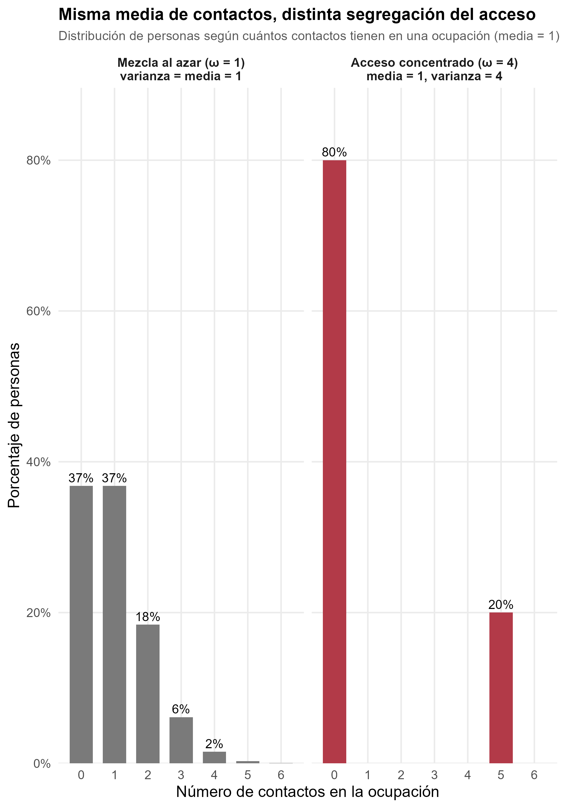
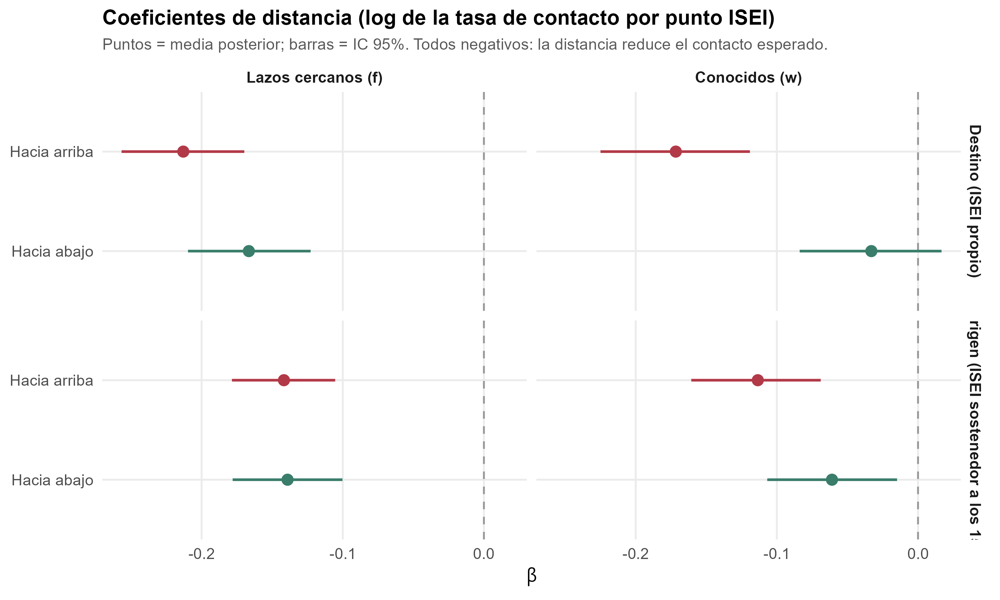
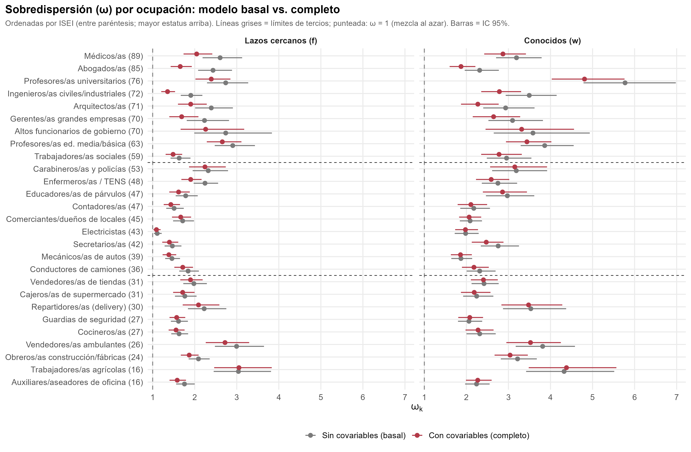
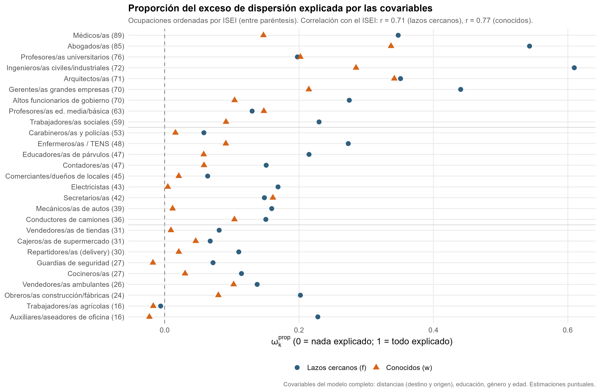

## Punto de partida: lo que el modelo anterior no podía responder {.smaller}

::: fragment
En la propuesta mostré que la distancia al **destino** y al **origen** predice la composición ocupacional de la red, con un gradiente más pronunciado para el destino. Ese modelo (binomial negativa multinivel, @espinosa-rada2026) permite saber *cuántos* contactos se reportan según la distancia.
:::

::: {.highlight-box .fragment}
**Dos preguntas quedaban abiertas:**

1) **¿Qué ocupaciones están más segregadas en su acceso?** Aun si hay homogeneidad en las redes, no sabemos si algunas ocupaciones concentran sus contactos en pocos círculos más que otras.

2) **¿Cuánto de esa segregación se asocia con la similitud socioeconómica**, y en qué ocupaciones pesa más el destino o el origen?
:::

::: notes
~0.5 min. Justifica el cambio de técnica: el modelo previo tenía efectos fijos por ocupación y un solo parámetro de dispersión, sin una medida de segregación por ocupación.
:::


```{=html}
<style>
#title-slide h1.title {
  font-size: 1.35em;
}

#title-slide .subtitle {
  font-size: 0.85em;
}

#title-slide .institute {
  font-size: 0.85em;
}
.reveal .slides {
  font-size: 0.85em;
}
.reveal pre {
  font-size: 0.5em !important;
}
.reveal .slides section.smaller pre {
  font-size: 0.65em !important;
}
.figura-pendiente {
  border: 2px dashed #999;
  padding: 0.6em;
  font-size: 0.65em;
  text-align: center;
  color: #555;
}
</style>
```

```{r}
#| label: setup-fuentes
#| include: false

library(systemfonts)
library(sysfonts)

sysfonts::font_add(
  family  = "Gill Sans MT",
  regular = "GIL_____.TTF",
  bold    = "GILB____.TTF",
  italic  = "GILI____.TTF"
)
showtext::showtext_auto()
```


------------------------------------------------------------------------

## Redes personales, acceso a recursos y reproducción de la desigualdad {.smaller}

::: fragment
- Los lazos con distintas ocupaciones dan acceso a **recursos beneficiosos** (información, oportunidades laborales, apoyo) y a la **integración en la sociedad** [@lin2001; @burt2010; @granovetterGettingJobStudy2010]. Por eso, medir la **segregación en el acceso a ocupaciones** muestra qué grupos están más aislados y clausurados entre sí [@diprete2011].
:::

::: fragment
- Esa clausura puede traducirse en **reproducción social** que perpetúa la desigualdad, dada la **co-constitución** de las redes personales con los logros ocupacionales de las personas [@dimaggio2012; @Bourdieu1986; @lin1999].
:::

::: fragment
**El caso chileno** combina alta desigualdad, baja movilidad intergeneracional, cierre de la clase alta y segregación residencial y educacional [@torche2014; @otero2021; @otero2022]: un contexto donde las oportunidades de contacto entre clases están estructuralmente restringidas.
:::

::: notes
~0.75 min. Idea fuerza (primer párrafo del manuscrito): las redes no solo reflejan la desigualdad, son un mecanismo de su reproducción.
:::

------------------------------------------------------------------------

## Pregunta y objetivos {.smaller}

::: {.highlight-box .fragment}
**Pregunta.** ¿Cómo se asocian la posición de **origen** y de **destino** con la **homogeneidad** y la **segregación ocupacional** de las redes de contacto en Santiago? ¿Cómo cambia esta relación entre vínculos **cercanos** y **conocidos**?
:::

::: fragment
**Objetivo general.** Analizar cómo la posición de origen y de destino se asocia con la homogeneidad y la segregación ocupacional de las redes de contacto en Santiago.
:::

::: fragment
a. Examinar cómo la **similitud ocupacional** con el destino y con el origen configura las redes de contacto.
b. Evaluar **cuánto de la segregación de cada ocupación** es explicada por esa similitud, frente a otras características individuales (educación, género, edad).
c. Ver cómo cambian a y b según la **cercanía del vínculo**: amigos cercanos y familiares vs. conocidos.
:::

::: notes
~0.75 min.
:::

------------------------------------------------------------------------

## Homogeneidad y segregación {.smaller}

| Concepto | Qué significa |
|------------------|-------------------------------------------------------|
| **Homogeneidad** | Los contactos de una persona tienden a parecerse a ella en estatus ocupacional. Resulta de la estructura de oportunidades (homofilia de base) y de la selección de similares (*inbreeding*) [@blau2018; @mcpherson2001] |
| **Segregación** | El acceso a una ocupación está concentrado en pocos egos o círculos, más allá del tamaño de la red y de la ocupación [@diprete2011; @vantubergen2015]|


::: fragment
Que una ocupación esté segregada quiere decir que sus contactos **no se reparten parejo entre las personas**: se concentran en algunas y otras no tienen ninguno. Si las ocupaciones son canales de información, apoyo e influencia, la segregación es una forma de **desigualdad en a quién se puede llegar**, más allá de qué posición se ocupa.
:::

::: fragment
**Relación.** La homogeneidad es un patrón de *a quién se conoce*; la segregación es el resultado agregado sobre *quién accede a una ocupación*. La homogeneidad es el mecanismo propuesto para explicar la segregación.
:::

::: fragment
**Foco intergeneracional.** Medir la homofilia respecto del **origen** y del **destino** indica cuánto se asemejan los contactos de una persona a su origen social, neto de su posición actual, y viceversa [@feld1981; @newman2008].
:::

::: notes
~1 min. Aquí solo se definen conceptos; el cómo se mide viene después de presentar el enfoque ARD.
:::

------------------------------------------------------------------------

## Preguntas analíticas (hipótesis en construcción) {.smaller}

::: {.highlight-box .fragment}
**1. Niveles de análisis.** ¿Las personas son más homogéneas respecto de su posición de **destino** (logros actuales) que de su **origen**?
:::

::: {.highlight-box .fragment}
**2. Dirección de la homogeneidad.** ¿Reportan más contactos con ocupaciones de **menor** o de **mayor** estatus que el propio, desde el destino y desde el origen?
:::

::: {.highlight-box .fragment}
**3. Contribución a la segregación.** ¿Cuánto contribuye la homogeneidad de los contactos a la segregación de las ocupaciones? ¿Dónde pesa más: en ocupaciones altas, bajas o ambas? ¿Es igual en lazos cercanos y en conocidos? ¿Contribuye más el origen o el destino?
:::

::: notes
~0.75 min. Hipótesis pendientes: las preguntas 2 y 3 desagregan por dirección (arriba/abajo), por ubicación en la jerarquía, por tipo de lazo y por polo. Puntos de partida teóricos del manuscrito para la 1: el destino genera exposición continua y el origen una huella más histórica [@blau1977; @feld1981; @newman2008]; para cercanos vs. conocidos: [@granovetter1973; @kretschmer2025]. No se plantean hipótesis para el resto de las covariables.
:::

------------------------------------------------------------------------

## Datos e instrumento {.smaller}

:::::: columns
::: {.column width="48%"}
**SSCNPA 2025**

- Región Metropolitana, 41 comunas
- Muestreo probabilístico multietápico estratificado
- N = 1.124 egos, 30.348 díadas ego-ocupación
:::

:::: {.column width="52%"}
**Generador de Posición** [@lin1986]

- 27 ocupaciones, puntaje ISEI-08 [@ganzeboom1992]
- *"¿Cuántas personas conoce que trabajen como...?"*
- *"De ellas, ¿cuántas son amigos cercanos o familiares?"*
::::
::::::

::: fragment
$$y_{ik} = c_{ik} = w_{ik} + f_{ik}$$

$f_{ik}$: **lazos cercanos** (amigos cercanos o familiares) · $w_{ik}$: **conocidos** (ni amigos cercanos ni familiares)
:::

::: {.highlight-box .fragment}
Los datos tienen la forma de **datos relacionales agregados (ARD)**: conteos de cuántas personas conoce el ego $i$ en cada subgrupo $k$ (aquí, ocupaciones), no los lazos uno a uno. Adoptamos este enfoque.
:::

::: notes
~0.5 min. Elige un solo par de términos (cercanos/conocidos o fuertes/débiles) y úsalo siempre.
:::

------------------------------------------------------------------------

## Enfoque ARD: de los conteos a la segregación {.smaller}

::: fragment
Los modelos ARD se desarrollaron para estimar el **tamaño de poblaciones ocultas o de difícil acceso** [@killworth1998a; @zheng2006]. La misma familia de modelos permite **estimar el nivel de segregación de grupos específicos** de la población, como ciertas ocupaciones [@zheng2006; @diprete2011; @gelman2021].
:::

::: fragment
Modelan cómo se **distribuyen los contactos** de una persona $i$ en un subgrupo $k$ según tres fuentes de variación:

1. **Tamaño demográfico** de cada grupo.
2. **Sociabilidad** de las personas: unas conocen a más gente que otras.
3. **Características sociodemográficas** que dan más acceso a ciertos grupos que a otros.
:::

::: {.highlight-box .fragment}
De ahí se deriva una distribución de los contactos,

$$y_{ik} \sim \text{NegBin}\big(\text{media}=\mu_{ik},\ \text{sobredispersión}=\omega_k\big)$$

y el parámetro de **sobredispersión** $\omega_k$ se interpreta en la literatura como el **nivel de segregación** del grupo $k$ [@zheng2006; @gelman2021].
:::

::: notes
~1 min. McCormick et al. (2010) y Zheng et al. (2006) para la estructura del modelo; DiPrete et al. (2011) para segregación en redes de conocidos.
:::

------------------------------------------------------------------------

## ¿Cómo calculan los ARD la segregación de una ocupación? {.smaller}

:::::: columns
::: {.column width="52%"}
- Si todos tuvieran la misma propensión a conocer gente de la ocupación $k$ (**mezcla al azar**), los conteos se distribuirían como una Poisson: **varianza = media**, $\omega_k = 1$.
- Si la propensión **varía entre personas** (algunas están dentro de los círculos de esa ocupación y otras no), los conteos se **concentran**: muchos ceros y pocas personas con varios contactos. Integrando esa heterogeneidad se obtiene la binomial negativa, con **varianza = $\omega_k$ × media** [@zheng2006].
- $\omega_k$ **mide cuánto se concentra el acceso** a $k$, una vez descontados el tamaño de red de cada ego y el tamaño de la ocupación. No hay un umbral para llamarla "alta": se interpreta **comparativamente y respecto de 1** [@baum2025].
:::

::: {.column width="48%"}
::: fragment
{width="80%" fig-align="center"}
:::
:::
::::::

::: notes
~1 min. Ejemplo: media 1; con 80 ceros y 20 cincos, varianza 4, ω = 4. El modelo sin covariables (Barrier Effects) da la segregación total de cada ocupación.
:::

------------------------------------------------------------------------

## El Covariate Model de Baum (2025) {.smaller}

::: fragment
Los ARD clásicos permiten estimar **cuán segregado** es el acceso a una ocupación, pero no **por qué**: $\omega_k$ resume toda la heterogeneidad sin explicarla. El **Covariate Model** [@baum2025] agrega covariables observadas de los egos y parte la propensión a conocer el grupo $k$ en dos componentes:

- una **parte explicada** por las covariables, y
- un **residuo**, cuya sobredispersión es $\omega'_k$.
:::

::: {.highlight-box .fragment}
**Ventajas frente a la tradición ARD**

- Estima cuán segregada es cada ocupación ($\omega_k$) **y cuánto de esa segregación explica** un conjunto de covariables ($\omega^{prop}_k$).
- Permite aislar el **aporte único** de una variable o de un bloque de variables ($\Delta\omega^{prop}_k$).
- Es un modelo anidado: compara directamente el modelo sin covariables con el modelo completo.
:::

::: fragment
Es de reciente desarrollo y **aún no se ha aplicado a la composición socioeconómica de las redes por origen y destino**. Nuestra extensión incluye covariables de la díada ego-ocupación (la distancia), lo que Baum consideró una ampliación natural del modelo.
:::

::: notes
~1 min. Baum (2025) usa ELSOC 2016 con 13 ocupaciones y covariables a nivel del ego; Lin (2001) motiva sus covariables. VERIFICAR con una búsqueda antes de afirmar que no hay aplicaciones previas.
:::

------------------------------------------------------------------------

## Variables y parámetros: homogeneidad {.smaller}

::: fragment
La **homogeneidad** se mide con una **distancia en la escala ISEI** entre el ego y cada ocupación ($\text{ISEI}_k$), calculada desde dos posiciones del ego [@espinosa-rada2026]:
:::

::: fragment
- **Destino:** el ISEI propio, a partir de su ocupación actual (ISCO-08).
- **Origen:** el ISEI de la ocupación del sostenedor del hogar cuando el ego tenía 15 años, usado habitualmente para estudiar orígenes sociales y movilidad.
:::

::: fragment
Cada distancia se **parte en dos tramos**: hacia arriba y hacia abajo 
$$D^{+}_{ik}=\max(0,\ \text{ISEI}_k-\text{ISEI}_i)$$ 
$$D^{-}_{ik}=\max(0,\ \text{ISEI}_i-\text{ISEI}_k)$$.
:::

::: {.highlight-box .fragment}
**Por qué.** Permite saber si la similitud se traduce en **más contactos con ocupaciones de mayor o de menor estatus** que el propio: a igual número de puntos ISEI de distancia, ¿se conoce a más gente por encima o por debajo? Con los cuatro tramos (destino y origen, arriba y abajo) el modelo estima la probabilidad de contacto en cada dirección, neta del otro polo.
:::

::: fragment
| Ego: ingeniero (72) · sostenedor: obrero (24) | Destino (arriba / abajo) | Origen (arriba / abajo) |
|------------------------|:------------------------:|:-----------------------:|
| Médico (ISEI 89)  | 17 / 0 | 65 / 0 |
| Guardia (ISEI 27) | 0 / 45 |  3 / 0 |
:::

::: notes
~1 min. "Arriba" y "abajo" son relativos a cada ego, no propiedades de la ocupación. Origen y destino están correlacionados; cada tramo se identifica neto del otro polo.
:::

------------------------------------------------------------------------

## Variables y parámetros: segregación {.smaller}

::: fragment
La **segregación no es una variable observada** sino un **parámetro del modelo**, derivado de la distribución de los conteos $y_{ik}$ (la variable observada).
:::

::: {.highlight-box .fragment}
$$\omega_k \text{ y } \omega'_k$$. Sobredispersión de la ocupación $k$ **sin covariables** ($\omega_k$, modelo basal: segregación total) y **con covariables** ($\omega'_k$: la que queda sin explicar). Nos dicen **cuán segregada** es cada ocupación y qué tan lejos está de $1$.
:::

::: {.highlight-box .fragment}
$$\omega^{prop}_k = \dfrac{\omega_k-\omega'_k}{\omega_k-1}$$ Proporción del exceso de dispersión que explica nuestro **conjunto de covariables** (distancias, educación, género y edad). Va de 0 (no explican nada) a 1 (lo explican todo), como un $R^2$ [@mccormick2010; @baum2025]. Indica cuánto **contribuyen las covariables a la segregación de esa ocupación**
:::

::: {.highlight-box .fragment}
$$\Delta\omega^{prop}_k$$ Diferencia de $\omega^{prop}_k$ entre el modelo completo y uno sin un bloque de variables: el **aporte único** de ese bloque a la segregación de $k$ (aquí, **la distancia al destino y la distancia al origen**, cada una con sus dos tramos). Se lee como $R^2$ incremental y los aportes **no tienen por qué sumar** [@baum2025].
:::

::: notes
~1 min. Qué nos van a decir: (1) ω: qué ocupaciones están más segregadas (comparar entre grupos y respecto de 1); (2) ω_prop: cuánto explican las covariables; (3) Δ: cuánto aporta cada fuente (destino vs origen) y en qué ocupaciones.
:::

------------------------------------------------------------------------

## Estrategia analítica: el modelo y sus parámetros {.smaller}

$$y_{ik} \sim \text{NegBin}(\mu_{ik},\ \omega'_k)$$

$$\log \mu_{ik} = \alpha_i + \log m_k + \pi_k + \sum_{l} \delta_{lk} X_{li} + \beta^{dest}_{up} D^{+}_{dest,ik} + \beta^{dest}_{down} D^{-}_{dest,ik} + \beta^{orig}_{up} D^{+}_{orig,ik} + \beta^{orig}_{down} D^{-}_{orig,ik}$$

::: {style="font-size: 0.8em;"}
| Parámetro | Qué representa |
|--------------|----------------------------------------------------------|
| $\alpha_i$ | **Sociabilidad** del ego $i$ (su tamaño de red en escala log): afecta por igual a todas las ocupaciones |
| $\log m_k$ | **Tamaño poblacional** de la ocupación $k$ (CASEN, RM), fijo: los contactos esperados si las redes se formaran al azar |
| $\pi_k$ | Desviación de la ocupación $k$ respecto de la mezcla proporcional al tamaño ($\log(b_k/m_k)$): su **presencia en las redes** más allá de su tamaño |
| $\delta_{lk}X_{li}$ | Efecto de la covariable $l$ del ego (**educación, género, edad**) sobre sus contactos con la ocupación $k$ (varía por ocupación) |
| $\beta^{dest}, \beta^{orig}$ | **Cambio en el log de contactos por punto ISEI** hacia arriba o hacia abajo del destino y del origen (comunes a las 27 ocupaciones) |
| $\omega'_k$ | **Sobredispersión residual**: segregación de $k$ que las covariables no explican |
:::

::: notes
~1 min. Por ahora los controles son educación, género y edad; ampliar según el marco teórico (Baum: que la teoría decida, no maximizar lo explicado). Con π_k ~ N(0, 2), log m_k es un ancla y no una restricción de proporcionalidad.
:::

------------------------------------------------------------------------

## Modelos estimados y estimación bayesiana {.smaller}

::: fragment
Para lazos cercanos ($f_{ik}$) y conocidos ($w_{ik}$), por separado:

1. **Modelo basal (Barrier Effects):** sin covariables, solo $\alpha_i + \log m_k + \pi_k$ → $\omega_k$.
2. **Modelo completo:** basal + educación, género, edad + las cuatro distancias → $\beta$ y $\omega'_k$.
3. **Sin distancia al destino** y **sin distancia al origen** (cada una con sus dos tramos) → $\Delta\omega^{prop}_k$ de cada fuente.
4. *Pendiente:* **sin las distancias** (solo covariables sociodemográficas) y **sin las sociodemográficas**.
:::

::: {.callout-note .fragment style="font-size: 1.35em;"}
**Estimación.** Los modelos se estiman con **inferencia bayesiana** mediante simulación MCMC (Stan [@carpenter2017], 4 cadenas, 2000 iteraciones). En vez de un único valor por parámetro, se obtienen miles de versiones plausibles de todos los parámetros a la vez, compatibles con los datos y con distribuciones previas débiles. Cada cantidad derivada ($\omega^{prop}_k$, $\Delta\omega^{prop}_k$, caídas porcentuales) se calcula en cada versión.
:::

::: notes
~0.75 min. Por qué bayesiano: hay un α_i por ego (1.124) con ~75% de ceros; ω^prop y Δ son cocientes y diferencias de parámetros; ω_k tiene una frontera en 1. Detalle y previas en el apéndice. Para el objetivo a basta el NB multinivel del manuscrito (robustez); no entrega la descomposición de la segregación.
:::

------------------------------------------------------------------------

## Resultados (muy) preliminares 1: ¿cuánto cae el contacto con la distancia? {.smaller}

::: fragment
{width="70%" fig-align="center"}
:::

::: fragment
Los 8 coeficientes de distancia son **negativos**: cuanto más lejos del estatus propio (o del de origen), menos contactos se reportan. No obstante, a igual distancia, entre **conocidos**, desde el destino, subir en estatus reduce el contacto mucho más que bajar. Entre **cercanos** la caída es casi simétrica, y desde el origen no hay evidencia de asimetría.
:::


::: notes
~1.25 min. Responde objetivo a y pregunta 2. Verifica que los β estén en puntos ISEI (el .stan trabaja con puntos crudos; revisa si el ajuste de producción usó D/10). Sin IC todavía. 
:::

------------------------------------------------------------------------

## Resultados (muy) preliminares 2: segregación de las ocupaciones {.smaller}

::: fragment
{width="80%" fig-align="center"}
:::


::: notes
~1 min. Con 27 ocupaciones el ajuste cuadrático es modesto (R² de 0,28 en cercanos y 0,13 en conocidos; mínimo del ajuste en ISEI ≈ 44 y ≈ 39). Presenta la U como tendencia, no como ley. Baum recomienda comparar entre grupos respecto de 1 más que rankear.
:::

------------------------------------------------------------------------

## Resultados (muy) preliminares 2: segregación de las ocupaciones {.smaller}

::: fragment
Promedio de $\omega_k$ por **tercio de estatus de la ocupación** (9 ocupaciones por tercio), sin covariables (basal) y con covariables (completo), y proporción del exceso de dispersión que explican las covariables ($\omega^{prop}_k$).
:::

::: {.fragment style="font-size: 1.05em;"}
| Tercio de estatus de la ocupación (ISEI) | Cercanos: $\omega_k$ basal | Cercanos: $\omega'_k$ completo | Cercanos: $\omega^{prop}_k$ | Conocidos: $\omega_k$ basal | Conocidos: $\omega'_k$ completo | Conocidos: $\omega^{prop}_k$ |
|----------------------|:--------:|:--------:|:--------:|:--------:|:--------:|:--------:|
| Alto (59-89)  | 2,40 | 1,94 | 0,35 | 3,47 | 2,98 | 0,21 |
| Medio (36-53) | 1,72 | 1,61 | 0,15 | 2,46 | 2,36 | 0,06 |
| Bajo (16-31)  | 2,12 | 2,01 | 0,11 | 2,91 | 2,85 | 0,03 |
:::

::: fragment
En ambos tipos de lazo, el tercio **medio** es el menos segregado y los extremos tienen niveles mayores de sobredispersión. Las covariables reducen $\omega_k$ sobre todo en el tercio **alto**, y casi nada en el bajo.
:::


------------------------------------------------------------------------

## Resultados (muy) preliminares 3: ¿cuánto explican las covariables? {.smaller}


::: fragment
{width="80%" fig-align="center"}
:::

::: notes
Las covariables (distancias, educación, género y edad) explican, en promedio, el **20% del exceso de dispersión en lazos cercanos y el 10% en conocidos**.

**Explican más la segregación de las ocupaciones altas que la de las bajas**: la correlación entre $\omega^{prop}_k$ y el ISEI de la ocupación es de **0,71** en cercanos y **0,77** en conocidos (p. ej., Ingenieros/as 0,61 y Abogados/as 0,54 en cercanos; Trabajadores/as agrícolas, Carabineros/as y Comerciantes, cerca de 0). Tras incorporar las covariables, la U de la segregación se aplana: $\omega'_k$ medio de las ocupaciones altas baja de 2,40 a 1,94 en cercanos, y casi no cambia en las bajas (2,12 a 2,01).

~1 min. Valores negativos de ω_prop: no leerlos como proporción negativa (Baum); con IC se verá si incluyen el cero. ω' se calculó a partir de ω y ω_prop por tercio de ocupaciones (9 por tercio).
:::

------------------------------------------------------------------------

## Resultados (muy) preliminares 4: ¿destino u origen? {.smaller}

::: fragment
En **lazos cercanos**, la distancia al destino aporta más que la del origen a la segregación: $\Delta\omega^{prop}$ medio de 0,034 (destino) vs. 0,018 (origen). En **conocidos**, los aportes son pequeños y ninguno domina (0,004 vs. 0,006).
:::


::: {.fragment style="font-size: 1.05em;"}
| Tercio de estatus de la ocupación (ISEI) | Destino (cercanos) | Origen (cercanos) | Destino (conocidos) | Origen (conocidos) |
|----------------------|:--------:|:--------:|:--------:|:--------:|
| Alto (59-89)  | 0,050 | 0,023 | 0,012 | 0,006 |
| Medio (36-53) | 0,029 | 0,010 | 0,001 | 0,004 |
| Bajo (16-31)  | 0,022 | 0,022 | -0,002 | 0,007 |
:::

::: fragment
Caso: **Abogados/as** en lazos cercanos, $\Delta$ destino = 0,194 vs. $\Delta$ origen = 0,008. Falta estimar el modelo **sin distancias** para ver cuánto aporta la distancia en conjunto frente a las covariables sociodemográficas.
:::

::: notes
~1 min. Responde pregunta 3 (origen vs destino, por tipo de lazo y por estatus). Son aportes únicos y origen/destino están correlacionados: no tienen por qué sumar. Los lazos cercanos incluyen familiares, cuya ocupación coincide por construcción con la de origen.
:::

------------------------------------------------------------------------

## Discusión preliminar: posibles mecanismos {.smaller}

::: fragment
En los **conocidos**, el contacto cae sobre todo al subir en estatus y casi no al bajar: la frontera opera hacia arriba, justo donde un vínculo débil podría dar acceso a recursos no redundantes. En los **cercanos**, la distancia penaliza hacia ambos lados: la intimidad se organiza **dentro de una misma franja de estatus**, y el origen sigue pesando aun descontada la posición actual [@blau1977; @newman2008].
:::

::: fragment
Una posibilidad es que muchos de esos vínculos surjan en **contextos de interacción de servicio y de la vida cotidiana** que organiza la posición actual [@feld1981]; en cambio, llegar a ocupaciones de mayor estatus exige compartir contextos que la jerarquía restringe. Entre cercanos, la **selección de similares** que requiere sostener un vínculo íntimo [@kretschmer2025; @leszczensky2015; @windzio2013] operaría en ambas direcciones.
:::

::: fragment
Los extremos aparecen más segregados que las ocupaciones intermedias, que podrían actuar como **puentes relacionales** [@blau2018; @cepic2020; @alecu2022; @otero2026]. Arriba, la similitud de estatus (+ variables sociodemográficas) explica una parte mayor de la segregación, consistente con procesos de **cierre** de las posiciones altas; abajo, la segregación estaría respondiendo a **otros mecanismos** no incluidos aún (geografía, contextos laborales,), lo que justifica ampliar las covariables.
:::

::: notes
**Por qué importa para la reproducción de la desigualdad.** Que el origen siga moldeando los lazos cercanos es consistente con que las redes **transmitan posición entre generaciones**. En esa lectura, la desigualdad no está solo en las posiciones que se alcanzan, sino en las posiciones a las que las redes permiten llegar.

~1 min. Son interpretaciones por contrastar, no resultados. Controles pendientes: zona geográfica, pareja e hijos; modelos sin distancias y sin sociodemográficas.
:::

------------------------------------------------------------------------

## Alcance y próximos pasos {.smaller}

::: {.callout-warning .fragment style="font-size: 1.25em;"}
**Alcance.** Diseño transversal: las asociaciones son consistentes con que la posición estructure la red y con que la red contribuya al logro.
:::

::: fragment
- Modelos **sin distancias** y **sin sociodemográficas**; ampliar controles que han sido desarrollados en literatura de capital social y desigualdad de clase en redes, que podrían contribuir a explicar la segregación ocupacional en grupos bajos (zona geográfica, pareja, hijos, ingresos, etc... [@lin2001; @])
- Contactos esperados por perfiles de origen y destino y por tercio de estatus
- Robustez: LOO-CV para comparar ajustes [@baum2025], tres grupos de estatus, y revisar diagnósticos de convergencia (Stan)
:::

::: notes
~0.5 min. Pide retroalimentación: (1) especificación de controles, (2) tratamiento de la movilidad, (3) endogeneidad.
:::

# ¡Muchas gracias! {.center background-color="#1A3A5C"}

## Referencias

::: {#refs}
:::

------------------------------------------------------------------------

# Apéndice {.center background-color="#1A3A5C"}

## A1. De la mezcla aleatoria al Covariate Model {.smaller}

| Modelo | Supuesto que relaja | Qué agrega |
|------------------|---------------------------|---------------------------|
| Random Degree | Mezcla aleatoria; prevalencia igual al tamaño poblacional | Tamaño de red $d_i = e^{\alpha_i}$ |
| Group Prevalence | La prevalencia puede diferir del tamaño poblacional | $b_k$ estimado |
| Barrier Effects | Mezcla aleatoria | $\omega_k$: propensión heterogénea por grupo [@zheng2006; @mccormick2010] |
| **Covariate Model** | Propensión sin explicar | Parte explicada por covariables + residuo $\omega'_k$ [@baum2025] |

------------------------------------------------------------------------

## A2. Bayes y MCMC en simple {.smaller}

- **Previa** (valores plausibles antes de ver los datos) + **verosimilitud** (los datos) → **posterior** (creencia actualizada)
- La posterior de un modelo con miles de parámetros no tiene fórmula cerrada: MCMC genera muestras de ella (aquí, 4 cadenas)
- **Previas débilmente informativas:** $\alpha_i \sim N(\mu_\alpha, \sigma_\alpha)$ con $\mu_\alpha \sim N(0,5)$ y $\sigma_\alpha \sim N^{+}(0,2)$; $\pi_k \sim N(0,2)$; $\delta_{lk} \sim N(0,\tau)$; $\beta \sim N(0,1)$; $\omega_k - 1 \sim \text{Gamma}(2, 0.5)$
- **Por qué no máxima verosimilitud:** un $\alpha_i$ por ego, con ~75% de ceros, es inestable; $\omega^{prop}$ y $\Delta\omega^{prop}$ son cocientes y diferencias de parámetros, que salen directo de la posterior con su intervalo; $\omega_k$ tiene una frontera en 1
- **Intervalo de credibilidad 95%:** probabilidad posterior de 95% de que el parámetro esté en ese rango
- Diagnósticos: Rhat, tamaño efectivo, divergencias, chequeo predictivo posterior [@carpenter2017]

------------------------------------------------------------------------

## A3. Tamaño poblacional, $\pi_k$ y el manuscrito {.smaller}

- En el manuscrito se usaron **efectos fijos por ocupación** en vez de un offset poblacional, para no imponer que la prevalencia en la red sea proporcional al tamaño de la ocupación [@zheng2006; @diprete2011].
- En el modelo de Baum, $\log m_k$ (CASEN) entra como ancla y $\pi_k = \log(b_k/m_k)$ se estima con una previa centrada en 0: **no impone proporcionalidad**, la deja abierta a los datos.
- Costo ya asumido en el manuscrito: no separa homofilia de base de *inbreeding* [@mcpherson2001].

------------------------------------------------------------------------

## A4. Segregación por ocupación (completo) {.smaller}

::: figura-pendiente
TABLA/FIGURA: $\omega_k$, $\omega^{prop}_k$ y $\Delta\omega^{prop}_k$ de las 27 ocupaciones, cercanos y conocidos (de `tabla_omega_prop_distancia_largo.csv` y `tabla_delta_omega_prop_distancia.csv`)
:::

------------------------------------------------------------------------

## A5. Convergencia y robustez {.smaller}

::: figura-pendiente
POR AGREGAR: Rhat, divergencias, chequeo predictivo posterior (proporción de ceros y varianza), LOO-CV vs. modelo de delta libre por ocupación (script 0928)
:::
